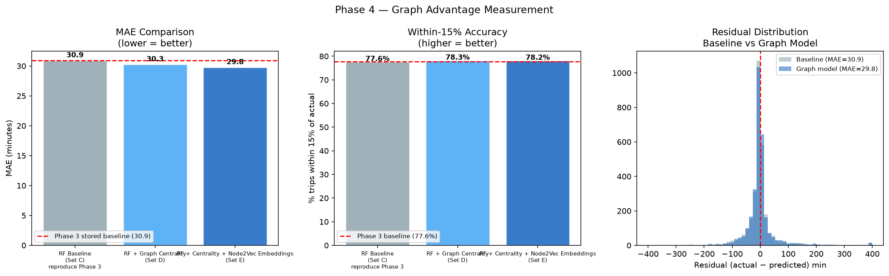
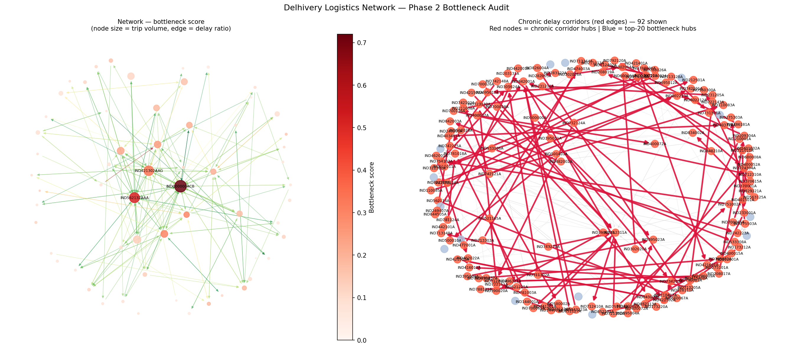
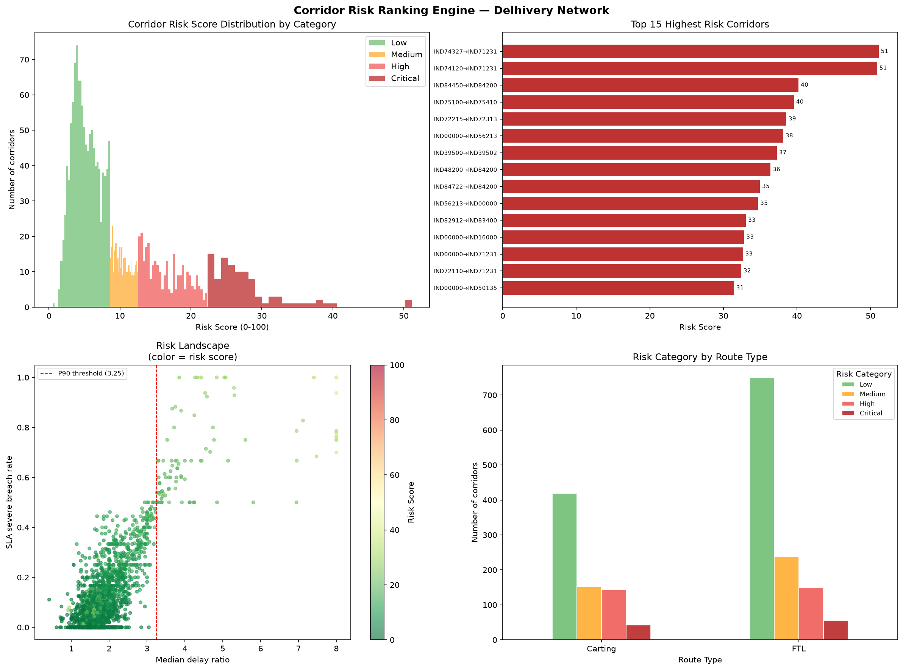
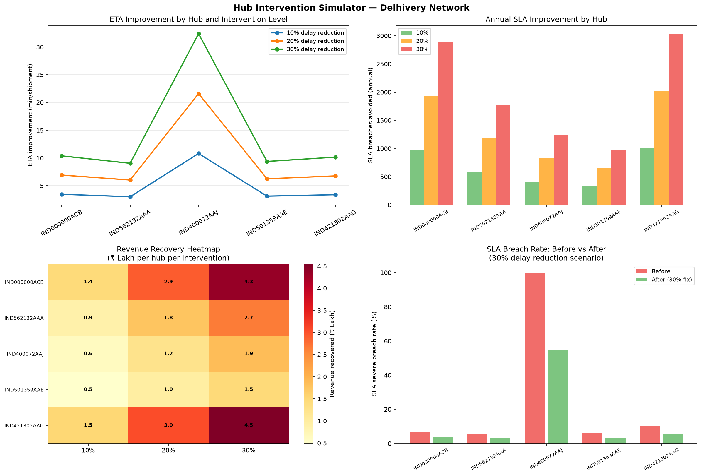

# Delhivery Logistics Network Intelligence

## Overview

This project analyzes Delhivery logistics data to identify shipment delay
patterns, predict ETA, detect bottleneck hubs, rank risky corridors, and
simulate operational interventions.

The project combines:

- Machine Learning
- Graph Analytics
- Network Science
- Operations Analytics
- Business Impact Simulation

The final output is a logistics intelligence system that helps answer:

> Which hubs and corridors should be prioritized to reduce ETA error, SLA breaches, and operational delays?

---

## Key Results

| Metric | Value |
|---|---:|
| Raw shipment segments | 144,867 |
| Cleaned shipment segments | 141,661 |
| Unique trips | 14,804 |
| Facilities / Nodes | 1,657 |
| Corridors / Edges | 2,781 |
| Chronic corridors | 92 |
| OSRM Baseline MAE | 161.5 min |
| Random Forest MAE | 30.95 min |
| Graph-Enhanced RF MAE | 29.85 min |
| Cross-Validation MAE | 28.81 +/- 0.48 min |

---

## Dashboard Preview

The Streamlit dashboard presents executive KPIs, ETA model performance,
network bottlenecks, corridor risk, delay propagation, and hub intervention
scenarios.









---

## Project Phases

### Phase 1 - Data Cleaning

Cleaned raw shipment segment data and removed inconsistent records.

### Phase 2 - Delay Analysis

Analyzed delay patterns by route type, time window, corridor, and facility.

Key findings:

- OSRM underestimates ETA by 69% at median.
- Carting delays are higher than FTL delays.
- 3 AM-4 AM trips show the highest delay.

### Phase 3 - Baseline ETA Model

Built a Random Forest ETA prediction model.

Result:

- OSRM MAE: 161.5 min
- RF MAE: 30.95 min

### Phase 4 - Graph-Enhanced ETA Model

Constructed a logistics network graph using facilities as nodes and shipment
corridors as edges.

Used:

- NetworkX
- Betweenness centrality
- Bottleneck scores
- Node2Vec embeddings
- Graph-enhanced Random Forest

Result:

- Graph RF MAE: 29.85 min
- Graph features improved MAE by 1.09 minutes.

### Phase 5 - Business Impact

Created strategy analysis covering:

- Revenue at risk
- FTL vs Carting comparison
- Bottleneck hub prioritization
- Chronic corridor analysis

---

## Additional Modules

### Delay Propagation Analysis

Identified hubs that act as:

- Delay sources
- Delay amplifiers
- Delay receivers

This helps understand how delays spread through the logistics network.

### Corridor Risk Ranking

Created a corridor-level risk score using:

- Delay ratio
- SLA breach rate
- Trip volume
- Hub centrality
- Route type

Low-volume corridors were filtered to avoid unreliable rankings from one-trip
outliers.

### Hub Intervention Simulator

Simulated 10%, 20%, and 30% delay reduction scenarios for top bottleneck hubs.

The simulator estimates:

- ETA improvement
- SLA breaches avoided
- Revenue recovered
- Best hub intervention priority

---

## Repository Structure

```text
.
├── app.py
├── requirements.txt
├── Dockerfile
├── README.md
├── assets/
│   └── plots/
├── artifacts/
│   └── delhivery_graph.edgelist
└── notebooks/
```

Large raw data and pickle checkpoints are intentionally kept out of GitHub.
The dashboard is designed to run from static plots and lightweight project
files.

---

## Dashboard

A Streamlit dashboard can be used to explore:

- ETA model performance
- Network bottlenecks
- Corridor risk ranking
- Delay propagation
- Hub intervention scenarios
- Strategy summary

Run locally:

```bash
streamlit run app.py
```

### Dashboard Files

The dashboard is intentionally lightweight and GitHub-ready:

- `app.py` contains the Streamlit dashboard.
- `assets/plots/` contains static PNG plots used by the dashboard.
- `artifacts/` contains optional local pickle result files.
- `requirements.txt` lists the Python dependencies.
- `Dockerfile` can build and run the app in a container.

The app does not require `data/delivery_data.csv` at runtime. If any pickle file
cannot be loaded, the dashboard still runs using static plots and hardcoded
summary metrics.

### Local Setup

```bash
python -m venv .venv
.venv\Scripts\activate
pip install -r requirements.txt
streamlit run app.py
```

Open the Streamlit URL shown in the terminal, usually:

```text
http://localhost:8501
```

### Docker

Build the image:

```bash
docker build -t delhivery-dashboard .
```

Run the container:

```bash
docker run -p 8501:8501 delhivery-dashboard
```

Then open:

```text
http://localhost:8501
```
