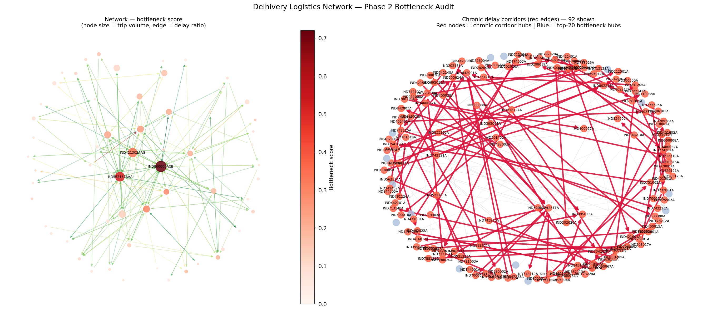
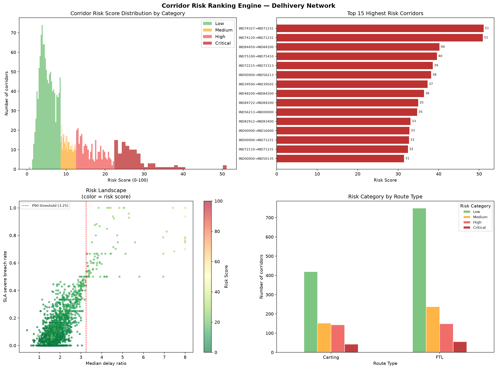

# Delhivery Logistics Network Intelligence


A Streamlit dashboard for finding ETA, corridor, and hub problems in a
logistics network. It combines a LightGBM + XGBoost ETA ensemble with NetworkX
graph features, corridor risk scoring, delay propagation analysis, and a
simple hub intervention simulator.

[Open the deployed dashboard](https://delhivery-logistics-network-intelligence-9fai7petrfsyvrbxs26fx.streamlit.app/)

## What it does

The analysis works at trip level after cleaning shipment segments. It covers:

1. ETA prediction and comparison with the OSRM baseline
2. Network bottleneck and corridor risk analysis
3. Delay propagation through downstream hubs
4. Hub intervention scenarios with estimated SLA and revenue impact

## Results

| Metric | Result |
| --- | ---: |
| Shipment segments after cleaning | 141,661 |
| Unique trips | 14,804 |
| Facilities | 1,657 |
| Corridors | 2,781 |
| Historical Random Forest MAE | 30.95 min |
| Boosting ensemble MAE | 29.49 min |
| Graph-enhanced boosting ensemble MAE | 28.00 min |
| Graph feature lift | 1.48 min MAE |
| Graph feature lift in within-15% accuracy | +1.08 percentage points |
| LightGBM/XGBoost blend | 55% / 45% |

The financial figures in the dashboard are estimates from the sample data,
not Delhivery financial results. The evidence files in `reports/evidence/`
show the assumptions behind those estimates.

## Dashboard preview







## Project layout

```text
app.py                         Streamlit dashboard
src/                           Data loading and analysis helpers
notebooks/                     Analysis notebooks by project phase
data/                          Shipment data used by the analysis
artifacts/                     Saved graph and model outputs
reports/evidence/              Small validation and assumption tables
assets/plots/                  Dashboard images
scripts/                       Evidence-pack generator
sql/                           Analytics queries and product views
requirements.txt               Dashboard dependencies
requirements-analysis.txt      Extra dependencies for rebuilding analysis outputs
```

Large local checkpoints and the virtual environment are not needed to run the
deployed fallback dashboard. They are also excluded from version control.

## Run locally

```bash
git clone https://github.com/Shradd7/Delhivery-logistics-network-intelligence.git
cd Delhivery-logistics-network-intelligence
pip install -r requirements.txt
streamlit run app.py
```

Then open `http://localhost:8501`.

To rebuild the evidence tables when the local checkpoints are available:

```powershell
pip install -r requirements-analysis.txt
python -B scripts/build_evidence_pack.py
```

Docker is also supported:

```bash
docker build -t delhivery-dashboard .
docker run -p 8501:8501 delhivery-dashboard
```

## Models and validation

The current model is a validation-weighted LightGBM + XGBoost regression
ensemble. The historical Random Forest is retained as a benchmark. Graph
features include facility centrality, bottleneck scores, severe-delay rates,
PageRank, corridor chronicity, hub interactions, and source/destination
embeddings. Evaluation is done after trip aggregation so segments from the
same trip do not cross the train, validation, and test splits.

### LightGBM + XGBoost ensemble

To train the boosted-tree ensemble using the saved phase checkpoints:

```powershell
python -m pip install -r requirements-analysis.txt
python scripts/train_boosting_ensemble.py
```

The runner selects the LightGBM/XGBoost blend weight on an internal validation
split, evaluates once on an untouched test split, and writes the results to
`artifacts/boosting_ensemble/`: `metrics.csv`, `feature_importance.csv`,
`permutation_importance.csv`, `feature_importance.png`,
`model_diagnostics.png`, and a reloadable `joblib` model bundle.

The graph features are loaded from the existing phase-4 checkpoint. For a
strict production estimate, rebuild those historical graph features using only
the training time window before fitting, because graph statistics calculated
from the full dataset can otherwise introduce temporal leakage.

To explicitly measure graph lift for the boosted ensemble, run:

```powershell
python scripts/phase5_graph_ensemble.py
```

This compares the same LightGBM + XGBoost ensemble with and without graph
features on identical validation and test rows. Results and the graph-lift
plot are written to `artifacts/phase5_graph_ensemble/`.

For a notebook presentation, open `notebooks/phase5_graph_ensemble.ipynb`, run
all cells, and save it. The notebook executes the same phase-5 script and
displays the metrics, graph-lift plot, and feature-importance table inline.

The phase-5 paired comparison trains the same ensemble with and without graph
features on identical rows. Graph features reduced MAE from 29.49 to 28.00
minutes and increased within-15% accuracy from 80.28% to 81.36%. For a strict
production estimate, rebuild historical graph statistics using only the
training time window before fitting to avoid temporal leakage.

## Next steps

Useful extensions would be live data refresh, intervention cost tracking,
scheduled retraining, and daily monitoring of ETA error and corridor risk.

## Author

[Shradd7 on GitHub](https://github.com/Shradd7)
